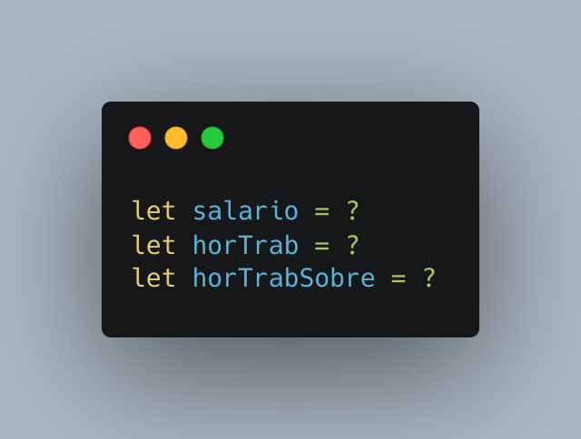

# Calculadora da base do sobreaviso de empresas.

### Realize a configuracao das seguintes variaveis:

- Salario
- Horas de Trabalho
- Horas de Trabalho em sobreaviso

Apos isso execute o programa e veja o resultado.

